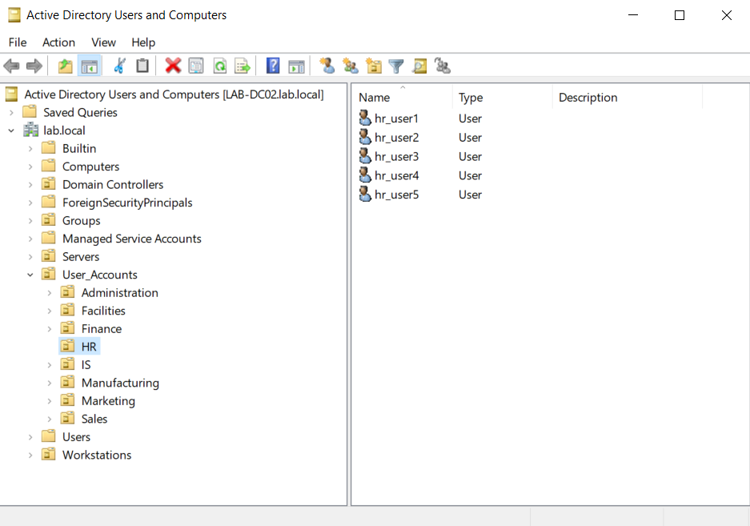
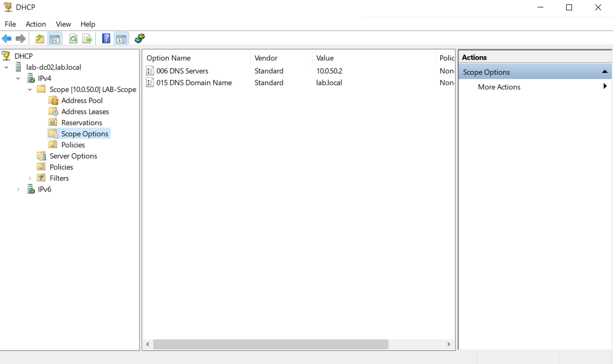
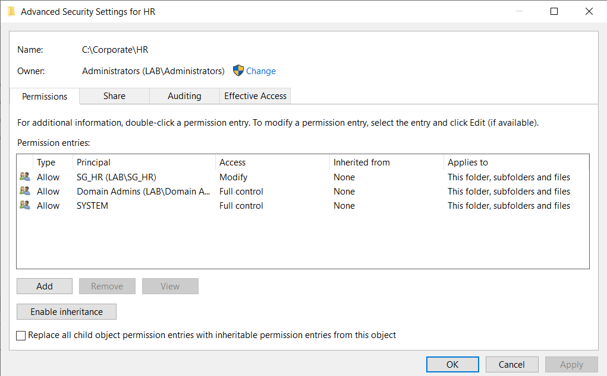

# Windows Server Active Directory Lab

## Overview
This project documents my hands-on practice building a Windows Server 2022 environment using Active Directory, DNS, DHCP, shared folders, NTFS permissions, and Group Policy.

The goal of this lab is to simulate real-world IT support and system administration tasks commonly performed in entry-level IT roles.

---

## Skills Practiced
- Active Directory user and group management  
- Organizational Unit (OU) structure  
- DNS and DHCP configuration  
- Shared folders and NTFS permissions  
- Group Policy basics  
- Troubleshooting user access issues  

---

## Tools Used
- Windows Server 2022  
- Windows 10/11 client VM  
- Hyper-V  
- Active Directory Users and Computers  
- DNS Manager  
- DHCP Manager  

---

## What I Built

I created a simulated business environment with department-based users, groups, and shared folders.

I configured:

- User accounts and security groups for multiple departments  
- Organizational Units (OUs) to structure the environment  
- Shared folders with NTFS permissions for controlled access  
- DNS and DHCP services, including scope configuration and scope options (DNS server and domain integration)

I also tested user access and troubleshot permission issues to better understand how systems interact in a real-world environment.

---

## Key Takeaways
This lab helped me understand how:
- Active Directory structures users and groups  
- Permissions control access to resources  
- Network services like DNS and DHCP support system functionality  
- Troubleshooting access issues requires both logical and systematic thinking

---

## Screenshots

### Active Directory Users and Groups

### DHCP Scope Configuration

### DHCP Scope Options (DNS & Domain Configuration)

### Shared Folder NTFS Permissions (Advanced)

