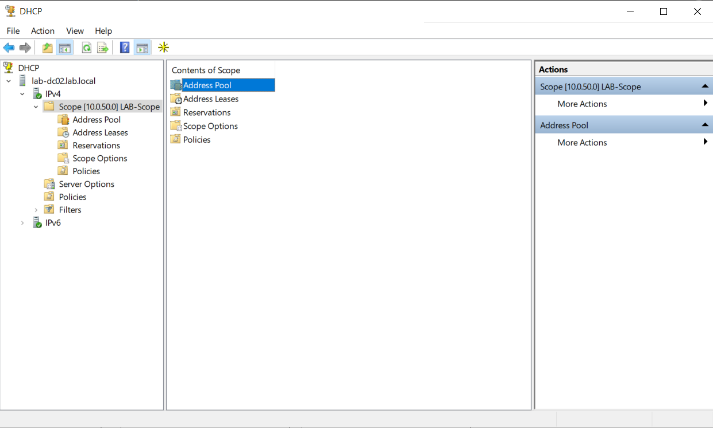

# Windows Server Active Directory Lab

## Overview

This project simulates a small business IT environment using Windows Server 2022, demonstrating hands-on configuration of Active Directory, DNS, DHCP, and access control.

The lab emphasizes building, validating, and troubleshooting core services, with a focus on understanding how network and domain components interact in a real-world environment.

---

## Skills Practiced

- Active Directory user and group management, including creation of Organizational Units (OUs) and department-based structure  
- DNS configuration and troubleshooting to support domain services and name resolution  
- DHCP scope creation and configuration, including IP addressing and lease management  
- Configuration of DHCP scope options (DNS server and domain name) to enable domain connectivity  
- Shared folder creation with NTFS permissions using security groups for controlled access  
- Basic troubleshooting of network and domain issues (DNS resolution, DHCP assignment, access permissions)  
- Validation of system configurations through user testing and access verification  

---

## Tools Used

- Windows Server 2022  
- Windows 10/11 client VM  
- Hyper-V  
- Active Directory Users and Computers  
- DNS Manager  
- DHCP Manager  

---

## What I Built

I created a simulated business environment with department-based users, groups, and shared resources.

Key configurations included:
- Active Directory structure with Organizational Units (OUs) and user accounts  
- DNS configuration to support domain services and name resolution  
- DHCP scope and scope options for automated IP addressing and domain connectivity  
- Shared folders with NTFS permissions using department-level security groups  

I validated configurations by testing user access and troubleshooting connectivity and permission-related issues.

---

## Lab Environment Design

- Domain: lab.local  
- Server: Windows Server 2022 (Domain Controller)  
- Client: Windows 10/11 VM  
- Services: Active Directory, DNS, DHCP  

- Internal Network: 192.168.1.0/24  
- Domain Controller IP: 192.168.1.10  
- DHCP Scope: 192.168.1.100–192.168.1.200

---

## Project Outcome

This lab demonstrates the ability to build and manage a functional Windows Server environment, including identity management, network services, and access control.

Through this project, I gained hands-on experience configuring core IT infrastructure and troubleshooting common issues related to DNS, DHCP, and user permissions.

This project reflects common responsibilities in entry-level IT roles, including user management, network configuration, and troubleshooting system access issues.

---

## Key Takeaways

This lab helped me understand how:
- Active Directory structures users and groups  
- Permissions control access to resources  
- Network services like DNS and DHCP support system functionality  
- Troubleshooting access issues requires both logical and systematic thinking

---

## How to Recreate This Lab

- Windows Server 2022 VM
- Active Directory Domain Services role installed
- DHCP configured with scope and options
- Shared folders with NTFS permissions by department

---

## Screenshots

### Active Directory Users and Groups

Created and organized user accounts within department-based Organizational Units (OUs), demonstrating structured Active Directory management.

---

### DHCP Scope Configuration

Configured a DHCP scope with defined IP address range, subnet mask, and lease duration to support client device connectivity.

---

### DHCP Scope Options (DNS & Domain Configuration)

Configured DHCP scope options including DNS server and domain name to enable proper name resolution and domain integration.

---

### Shared Folder NTFS Permissions (Advanced)

Applied advanced NTFS permissions using security groups to enforce department-level access control and secure shared resources.

---

### Network Diagram

This diagram illustrates how the domain controller, client machine, and network services interact within the lab environment.

---

## Troubleshooting & Lessons Learned

During the lab, I encountered several common configuration issues and worked through them to better understand how Windows Server services interact.

### Active Directory / Domain Setup
- **Issue:** Initial confusion around domain structure and OU organization.
- **Cause:** Lack of planning for how users and departments should be logically grouped.
- **Fix:** Reorganized OUs into department-based structure (HR, Finance, IT, etc.) to better reflect a real-world environment.

---

### DNS Configuration
- **Issue:** Clients were unable to resolve domain names or join the domain.
- **Cause:** DNS was not properly configured or clients were not pointing to the domain controller as their DNS server.
- **Fix:** Verified DNS role was installed, ensured proper forward lookup zone was created, and confirmed clients were using the correct DNS server IP.

---

### DHCP Scope Issues
- **Issue:** Client machines were not receiving IP addresses automatically.
- **Cause:** DHCP scope was either not activated or improperly configured.
- **Fix:** Activated the DHCP scope and verified IP range, subnet mask, and lease settings were correctly defined.

---

### DHCP Scope Options (DNS & Domain)
- **Issue:** Clients received IP addresses but could not resolve domain resources.
- **Cause:** DNS server and domain name were not configured in DHCP scope options.
- **Fix:** Configured DHCP options (006 DNS Servers and 015 DNS Domain Name) to point to the domain controller and local domain.

---

### NTFS Permissions / Shared Folder Access
- **Issue:** Users were unable to access shared folders as expected.
- **Cause:** Incorrect or missing security group permissions.
- **Fix:** Assigned permissions using department-based security groups and verified effective access through testing with different user accounts.

---

### Client Domain Connectivity Issue
- **Issue:** Client machine was unable to join the domain.
- **Cause:** Incorrect DNS configuration pointing outside the domain.
- **Fix:** Updated client DNS settings to point to the domain controller.

---

### General Takeaways
These issues reinforced the importance of:
- Proper planning of AD structure before implementation  
- DNS as a critical dependency for domain functionality  
- Ensuring DHCP and DNS work together correctly  
- Using security groups (not individual users) for scalable permission management  
- Testing access from the user perspective to validate configurations  
